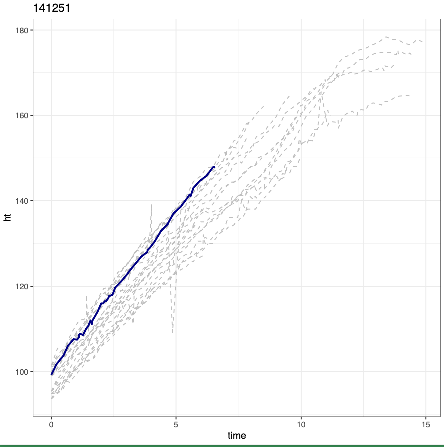

```{r setup, include=FALSE, cache=F, message=F, warning=F, results="hide"}
knitr::opts_chunk$set(cache = TRUE, echo = FALSE, message = FALSE, warning = FALSE)
knitr::opts_chunk$set(fig.height = 4, fig.width = 5, out.width = '30%', fig.align='center')
```

# Background 

## Data

The EPIC Observational Study:

- Prospective, multi-center, observational longitudinal study
- Collected through the Cystic Fibrosis Foundation Patient Registry (CFFPR)
- Of the 1772 children enrolled, we identified **1325 individuals** with usable data, total 76497 visit observations

For this study,

- 913 children are randomly assigned as training group
- The other 457 children are assigned as testing group

## Data

```{r "table", out.width='50%', fig.align='center'}

```


## People-like-me

The traditional predictive modeling: 

- A global inference and universal modelling over all available data. 
- Overlooking the cultural diversity and genetic heterogeneity for patients

People-like-me method:

- Individualized curving matching 
- To use fewer but more similar samples
- To get a higher predictive performance than with more similar matches
- Information of ***the nearest neighbors of predictive mean***

## Predictive mean matching

- The imputations created by predictive mean matching follow the data nicely
- With respect to **certain metrics**
- To avoid the dataset noise and model misspecification

**Through exhaustive comparisons with predictive mean, 
for specific target and the most similar matching donor-cohort**


## Donor-cohort

1.  "The chosen threshold" 

  Choose a threshold, and take all donors agreed within this threshold


2.  "The nearest neighbor" 

  Decide the number of matching donors, and choose this number of donors with minimal metrics. 
  
3.  "Single-time" v.s "Multiple-time"

4.  Which metric to use

In the past: with predictive mean matching with *single time point*  and a *fixed* number of candidate donors.

## Example 

```{r out.width='60%', fig.align='center'}

```


## Mahalanobis Distance

- Mahalanobis distance is a multivariate distance metric, measuring the distance between a point and a distribution.

$$
\pmb D^2 = (\pmb x - \pmb \mu)^T \cdot \pmb \Sigma^{-1} \cdot (\pmb x - \pmb \mu)
$$

Where:

  - $\pmb D^2$ is the square of the Mahalanobis distance
  - $\pmb x$ is the vector of the observation ($n$ row in a dataset)
  - $\pmb \mu$ is the vector of mean values of independent variables (mean of each column)
  - $\pmb \Sigma$ is the covariance matrix of independent variables.

- The squared Mahalanobis distance, $\pmb D^2$, is Chi-square distributed. 

- Based on the $\chi^2$ test $p$-value, we can find the acceptance of given donors.

# What we got so far

## Steps

- Fitting a `brokenstick` model with training dataset and getting the predictive imputations

```
brokenstick_prediction(formula = "ht ~ time | id",
                       train_data = train,
                       knots = c(5, 10, 12),
                       pred_time = c(2, 4, 6, 8, 10, 12, 14),
                       newdata = test_baseline)
```

- Fitting a `linear model` at for all the subjects with baseline information 
- Getting the predictive values at each time point from `linear models`

```
linearized_brokenstick(lm_formula = "`.pred` ~ time_factor * sex + baseline + ...",
                      bks_pred = bks_pred)
```

## Steps

With each subject from testing dataset,

- Calculating the metrics, e.g. Euclidean distance or Mahalanobis distance, between the target with all the others in training dataset
- Deciding on the set and the size of `donor-cohort`
- Fitting `gamlss` model with `donor-cohort` observations
- Getting the prediction and confidence intervals

```
pred_matching(lb_data = lb_data, obs_data = test_data,
              match_methods = c("mahalanobis", "euclidean", "singletime"),
              match_alpha or match_number,
              gamlss_formula = "ht ~ cs(time, df = 3)",  
              gamsigma_formula = "~ cs(time, df = 1)",
              match_plot = TRUE,  predict_plot = TRUE,)
```

## Simulation of 20 datasets


```{r out.width='120%', fig.align='center'}

```


A larger simulation study with 1000 datasets is going on with [OGS Connect](https://www.osgconnect.net/)

## Package and Shinyapp

```{r}
library(plmlmm)
plmlmm:::run_shiny()
```

# Thanks

Thanks for everyone's patience!!!
